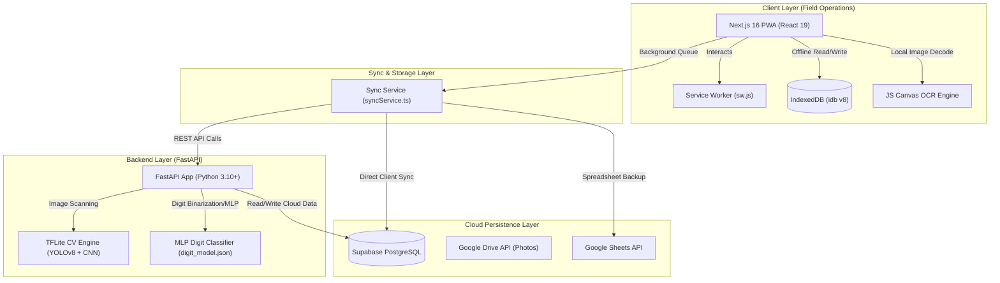
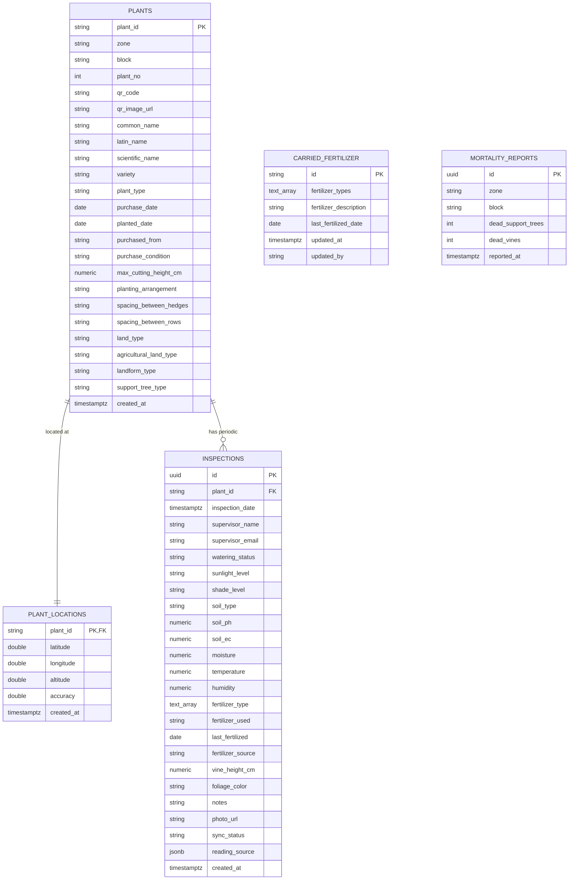
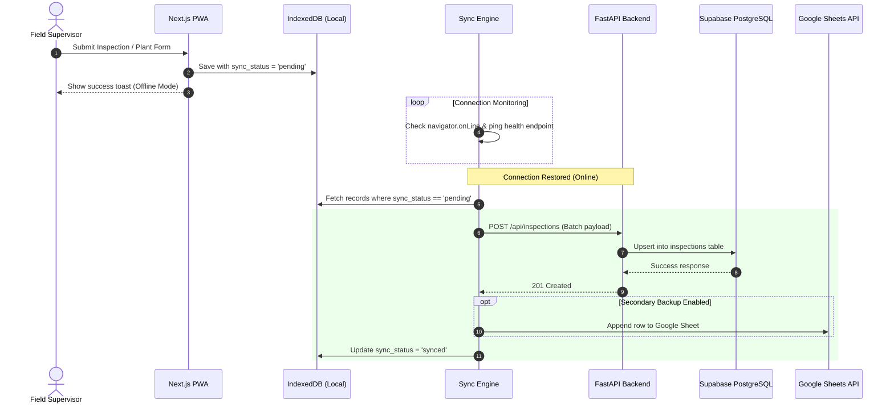

# 🌿 Vanilla Monitor — Full Project Architecture & Technical Specifications

> **System Overview**: Vanilla Monitor is an enterprise-grade Progressive Web Application (PWA) and microservice ecosystem engineered for real-time vanilla plantation management, offline-first field inspections, digital twin GPS mapping, computerized sensor display OCR digitization, and multi-tier database synchronization.

---

## 📐 1. High-Level System Architecture

The Vanilla Monitor system follows an **offline-first hybrid cloud/edge architecture** designed to operate seamlessly in remote agricultural fields with zero or spotty connectivity.



---

## 🛠️ 2. Comprehensive Technology Stack Matrix

| Layer / Subsystem | Technology | Version | Purpose & Description |
| :--- | :--- | :--- | :--- |
| **Frontend Core** | Next.js (App Router) | `16.2.9` | SSR/SSG & Client-side PWA shell |
| | React & React DOM | `19.2.4` | Component framework with dynamic rendering |
| | TypeScript | `^5.0.0` | Type-safe system interfaces & domain models |
| **PWA & Storage** | Service Worker | Custom JS | Offline asset caching & network proxying |
| | `idb` (IndexedDB Wrapper) | `^8.0.3` | Client-side transactional database for offline queue |
| | Zustand | `^5.0.14` | Client-side reactive UI state management |
| **Styling & Icons** | Tailwind CSS | `^4.0.0` | Utility-first responsive design & custom design tokens |
| | Lucide React | `^1.21.0` | Agricultural UI icons |
| | Next Themes | `^0.4.6` | Dark mode / Light mode switching |
| **Geospatial & Mapping** | Leaflet & React-Leaflet | `^1.9.4` / `^5.0.0` | Interactive GPS vine mapping & digital twin overlay |
| **Forms & Validation** | React Hook Form | `^7.80.0` | High-performance form state management |
| | Zod & Resolvers | `^4.4.3` | Schema validation for inspections and vine setup |
| **Analytics & Data Viz** | Recharts | `^3.9.0` | Real-time sensor trend graphs & health metrics |
| **Scanning & Computer Vision** | HTML5-QRCode & QRCode | `^2.3.8` / `^1.5.4` | QR Code scanner for vine tags & generator |
| | Canvas API + MLP JS | Browser Native | Client-side 7-segment digit OCR engine |
| **Backend API** | FastAPI | `>=0.100.0` | Asynchronous RESTful microservice framework |
| | Uvicorn | `>=0.22.0` | ASGI web server |
| | Pydantic | `>=2.0` | API request/response serialization & validation |
| **Computer Vision Engine** | Pillow (PIL) & NumPy | `>=10.0.0` / `>=1.20.0` | Image processing, Otsu thresholding & array matrix ops |
| | TFLite Runtime | Latest | Edge AI inference engine (YOLOv8 + Digit CNN) |
| **Cloud Database & BaaS** | Supabase (PostgreSQL) | `^2.108.2` (JS) / `>=2.0.0` (Py) | Primary relational cloud storage with RLS policies |
| **Third-Party Services** | Google Workspace APIs | REST APIs | Google Drive image upload & Google Sheets sync |
| **Deployment / Infra** | Docker & Render / Netlify | Multi-stage Dockerfiles | Containerized backend/frontend microservices |

---

## 🗄️ 3. Complete Database Architecture & Schemas

### 3.1 Cloud Relational Database Schema (Supabase PostgreSQL)



#### SQL Schema DDL (`backend/supabase_schema.sql`)

```sql
CREATE EXTENSION IF NOT EXISTS "uuid-ossp";

-- 1. Plants Table (Static Information & Botanical Data)
CREATE TABLE plants (
    plant_id TEXT PRIMARY KEY,
    zone TEXT NOT NULL,
    block TEXT NOT NULL,
    plant_no INTEGER NOT NULL,
    qr_code TEXT,
    qr_image_url TEXT,
    common_name TEXT,
    latin_name TEXT,
    scientific_name TEXT,
    variety TEXT,
    plant_type TEXT,
    purchase_date DATE,
    planted_date DATE,
    purchased_from TEXT,
    purchase_condition TEXT,
    max_cutting_height_cm NUMERIC,
    planting_arrangement TEXT,
    spacing_between_hedges TEXT,
    spacing_between_rows TEXT,
    land_type TEXT,
    agricultural_land_type TEXT,
    landform_type TEXT,
    support_tree_type TEXT,
    created_at TIMESTAMP WITH TIME ZONE DEFAULT timezone('utc'::text, now())
);

-- 2. Plant Locations Table (GPS Geographical Coordinates)
CREATE TABLE plant_locations (
    plant_id TEXT PRIMARY KEY REFERENCES plants(plant_id) ON DELETE CASCADE,
    latitude DOUBLE PRECISION NOT NULL,
    longitude DOUBLE PRECISION NOT NULL,
    altitude DOUBLE PRECISION,
    accuracy DOUBLE PRECISION,
    created_at TIMESTAMP WITH TIME ZONE DEFAULT timezone('utc'::text, now())
);

-- 3. Inspections Table (Periodic Field Observation Logs)
CREATE TABLE inspections (
    id UUID PRIMARY KEY DEFAULT uuid_generate_v4(),
    plant_id TEXT NOT NULL REFERENCES plants(plant_id) ON DELETE CASCADE,
    inspection_date TIMESTAMP WITH TIME ZONE DEFAULT timezone('utc'::text, now()),
    supervisor_name TEXT,
    supervisor_email TEXT,
    watering_status TEXT,
    sunlight_level TEXT,
    shade_level TEXT,
    soil_type TEXT,
    soil_ph NUMERIC,
    soil_ec NUMERIC,
    moisture NUMERIC,
    temperature NUMERIC,
    humidity NUMERIC,
    fertilizer_type TEXT[],
    fertilizer_used TEXT,
    last_fertilized DATE,
    fertilizer_source TEXT DEFAULT 'edited',
    vine_height_cm NUMERIC,
    foliage_color TEXT,
    notes TEXT,
    photo_url TEXT,
    sync_status TEXT DEFAULT 'synced',
    reading_source JSONB DEFAULT '{}'::jsonb,
    created_at TIMESTAMP WITH TIME ZONE DEFAULT timezone('utc'::text, now())
);

-- 4. Carried Fertilizer Table (Offline Plantation Preferences Cache)
CREATE TABLE carried_fertilizer (
    id TEXT PRIMARY KEY,
    fertilizer_types TEXT[],
    fertilizer_description TEXT,
    last_fertilized_date DATE,
    updated_at TIMESTAMP WITH TIME ZONE DEFAULT timezone('utc'::text, now()),
    updated_by TEXT
);

-- 5. Mortality Reports Table (Block-Level Health Tracking)
CREATE TABLE mortality_reports (
    id UUID PRIMARY KEY DEFAULT uuid_generate_v4(),
    zone TEXT NOT NULL,
    block TEXT NOT NULL,
    dead_support_trees INTEGER DEFAULT 0,
    dead_vines INTEGER DEFAULT 0,
    reported_at TIMESTAMP WITH TIME ZONE DEFAULT timezone('utc'::text, now())
);
```

---

### 3.2 Client-Side Offline Database Schema (IndexedDB `vanilla-monitor` v3)

Managed via `frontend/src/lib/offline-db.ts` to ensure full offline capability:

| Object Store Name | Key Path | Auto Increment | Indices Created | Description / Purpose |
| :--- | :--- | :--- | :--- | :--- |
| `plants` | `plant_id` | `false` | `sync_status` | Local cache of vine registry records |
| `plant_locations` | `plant_id` | `false` | `sync_status` | Local cache of GPS locations |
| `inspections` | `id` | `false` | `sync_status`, `plant_id` | Offline inspection queue awaiting upload |
| `mortality_reports`| `id` | `false` | `zone`, `block` | Offline block mortality logs |
| `submissions` | `id` | `false` | `status`, `zone`, `submittedAt`, `plant_id` | Legacy inspection submissions store |
| `plant_gps` | `plant_id` | `false` | - | Simplified GPS key-value lookup |
| `settings` | `key` | `false` | - | App configuration & supervisor profile store |

---

## 👁️ 4. Machine Learning & Computer Vision (OCR) Subsystem Architecture

The system supports **dual-tier meter digitization**:
1. **Lightweight Client-Side JS OCR**: Real-time browser recognition via Canvas image manipulation and MLP neural network.
2. **Advanced Backend Python TFLite/MLP Pipeline**: Deep learning detection using YOLOv8 object detection and CNN digit classifiers.

```mermaid
flowchart LR
    MeterPhoto["Camera Meter Image"] --> Grayscale["Grayscale & Contrast Boost"]
    Grayscale --> Otsu["Otsu Threshold Binarization"]
    Otsu --> ColProjection["Horizontal Column Sum Projection"]
    ColProjection --> Segments["Digit Slot Bounding Boxes"]
    Segments --> AspectResize["Aspect-Preserving 28x28 Resizing"]
    AspectResize --> MLP["3-Layer Neural Net (W1, W2, W3)"]
    MLP --> Softmax["Softmax Class Probabilities"]
    Softmax --> ExtractedVal["Extracted Field Value (e.g., pH: 6.5)"]
```



### Technical OCR Algorithm Steps:
1. **Otsu Binarization**: Automatically computes optimal threshold $T$ by maximizing inter-class variance $\sigma_b^2(t)$:
   $$\sigma_b^2(t) = \omega_0(t)\omega_1(t)[\mu_0(t) - \mu_1(t)]^2$$
2. **Horizontal Profile Segmentation**: Sums active foreground pixels along columns to calculate bounding segments for individual digits.
3. **Canvas Aspect-Ratio Preserving Normalization**: Centers digit bounding boxes onto standard $28 \times 28$ vector grids.
4. **Feedforward MLP Inference**:
   $$h_1 = \text{ReLU}(X W_1 + b_1)$$
   $$h_2 = \text{ReLU}(h_1 W_2 + b_2)$$
   $$\text{logits} = h_2 W_3 + b_3$$
   $$\hat{y} = \text{Softmax}(\text{logits})$$

---

## ⚡ 5. Offline Synchronization Engine Architecture

The sync engine (`frontend/src/lib/syncService.ts`) coordinates zero-data-loss synchronization between IndexedDB, FastAPI, Supabase PostgreSQL, and Google Sheets.



---

## 🌐 6. REST API Endpoint Specifications

### 6.1 System Health
- **`GET /health`**
  - **Response**: `{"status": "healthy", "timestamp": "ISO-8601", "database_connected": true}`

### 6.2 Plant Management
- **`POST /api/plants`**: Register or update vine static details.
  - **Request Body**: `Plant` JSON model.
- **`GET /api/plants`**: Retrieve all registered vines.

### 6.3 GPS & Digital Twin Location Tracking
- **`POST /api/plant_locations`**: Save high-precision vine GPS coordinates.
- **`GET /api/plant_locations`**: Retrieve spatial coordinate mapping for Leaflet digital twin.
- **`POST /api/gps`**: Backward-compatible GPS sync endpoint.
- **`GET /api/gps`**: Backward-compatible spatial data retrieval.

### 6.4 Inspection Logging
- **`POST /api/inspections`**: Create/upsert periodic field inspection record.
- **`GET /api/inspections`**: Fetch chronological list of inspections.

### 6.5 Block Mortality Reports
- **`POST /api/mortality`**: Submit dead vine and dead support tree counts per zone/block.
- **`GET /api/mortality`**: Retrieve aggregate mortality metrics.

### 6.6 Computer Vision & Meter Scanning APIs
- **`POST /api/ocr/decode-field`**:
  - **Payload**: `multipart/form-data` with `file` (Image), `num_digits` (int), `has_decimal_at` (optional int).
  - **Output**: `{"value": 6.8}` or `{"value": null}`.
- **`POST /api/ocr/scan-meter`**:
  - **Payload**: Image file upload of full digital meter.
  - **Output**: `{"ph": 6.2, "ec": 0.18, "temperature": 27.5, "humidity": 82.0}`.

---

## 🗺️ 7. Frontend Structure & Application Hierarchy

```
frontend/
├── public/
│   ├── sw.js                 # Service Worker (PWA Caching & Offline Proxy)
│   └── manifest.json         # PWA Installation Manifest
├── src/
│   ├── app/
│   │   ├── layout.tsx        # Root HTML Layout with Theme & PWA Providers
│   │   ├── page.tsx          # Main Dashboard & Overview Analytics
│   │   ├── add-plant/        # Vine Registration Form
│   │   ├── blocks/           # Plantation Block Explorer (Zones A-D, Blocks 1-12)
│   │   ├── dashboard/        # Detailed Sensor Data Visualizations
│   │   ├── digital-twin/     # Interactive Leaflet Map & Spatial Coordinates
│   │   ├── history/          # Historical Inspection Search & Filter
│   │   ├── inspect/          # Individual Vine Inspection View
│   │   ├── new-inspection/   # Camera OCR & Inspection Form Entry
│   │   ├── plant/            # Vine Profile Details
│   │   ├── plants/           # Complete Vine Directory
│   │   └── profile/          # Supervisor Profile & Settings
│   ├── components/
│   │   ├── BottomNav.tsx     # Mobile Navigation Dock
│   │   ├── ClientLayout.tsx  # Dynamic Layout Shell & Online Status Listener
│   │   ├── ContextBadge.tsx  # Zone & Block Context Indicator
│   │   ├── OfflineBanner.tsx # Offline Status & Sync Alert Banner
│   │   └── ProgressBar.tsx   # Inspection Step Progress Bar
│   └── lib/
│       ├── authService.ts    # Authentication & Supervisor Profiles
│       ├── digit_model.json  # Pre-trained MLP Classifier Weights (Weights & Biases)
│       ├── meterOcr.ts       # Browser Canvas OCR Preprocessing & Digit Extractor
│       ├── offline-db.ts     # IndexedDB Database Management
│       ├── sheetsService.ts  # Google Sheets REST API Client
│       ├── supabaseClient.ts # Supabase JS SDK Initialization
│       ├── syncService.ts    # Automatic Multi-Target Background Sync Engine
│       └── types.ts          # TypeScript Domain Interfaces & Models
```

---

## 🐳 8. Deployment, Containerization & Infrastructure

### 8.1 Backend Dockerfile (`backend/Dockerfile`)

```dockerfile
FROM python:3.10-slim

WORKDIR /app

RUN apt-get update && apt-get install -y --no-install-recommends \
    build-essential \
    libgl1-mesa-glx \
    libglib2.0-0 \
    && rm -rf /var/lib/apt/lists/*

COPY requirements.txt .
RUN pip install --no-cache-dir -r requirements.txt

COPY . .

EXPOSE 8000

CMD ["uvicorn", "main:app", "--host", "0.0.0.0", "--port", "8000"]
```

### 8.2 Frontend Dockerfile (`frontend/Dockerfile`)

```dockerfile
FROM node:18-alpine AS builder
WORKDIR /app
COPY package*.json ./
RUN npm ci
COPY . .
RUN npm run build

FROM node:18-alpine AS runner
WORKDIR /app
ENV NODE_ENV=production
COPY --from=builder /app/package*.json ./
COPY --from=builder /app/.next ./.next
COPY --from=builder /app/public ./public
COPY --from=builder /app/node_modules ./node_modules

EXPOSE 3000
CMD ["npm", "start"]
```

### 8.3 Infrastructure Orchestration
- **Render (`render.yaml`)**: Automatically deploys the FastAPI backend with health check path `/health`.
- **Netlify (`netlify.toml`)**: Deploys Next.js PWA with dynamic SPA routing redirects (`/* -> /index.html`).

---

## ⚡ Quickstart Execution Summary

```bash
# 1. Backend Launch
cd backend
python -m venv .venv
# Windows: .\.venv\Scripts\activate | Mac/Linux: source .venv/bin/activate
pip install -r requirements.txt
uvicorn main:app --reload --port 8000

# 2. Frontend Launch
cd frontend
npm install
npm run dev
```

- **Frontend Application**: `http://localhost:3000`
- **Backend API**: `http://localhost:8000`
- **Interactive Swagger Docs**: `http://localhost:8000/docs`
